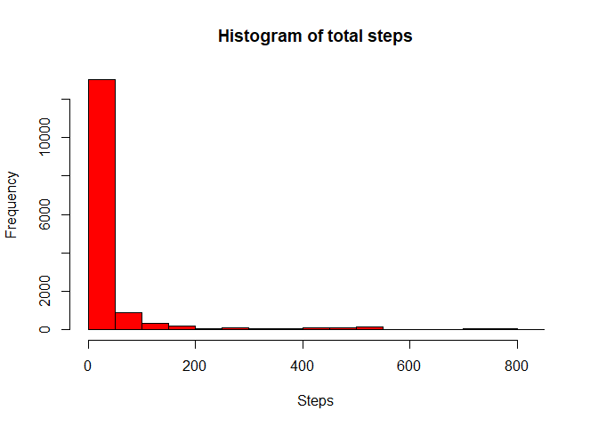

```r
knitr::opts_chunk$set(echo = TRUE,results = "asis")
```

## Loading and preprocessing the data

Data are loaded from the working directory and the data format is changed


```r
    setwd("F:/COURSERA/Reproducible Research/2° week")
    activity<-read.csv("activity.csv")
    activity$date<-as.Date(as.character(activity$date)) 
```

## What is mean total number of steps taken per day?

Total number of steps are computed.
Mean and median of steps are computed.
Histogram of total steps is plotted.


```r
    Total_steps<-sum(activity$steps,na.rm=T)
    mean_step<-mean(activity$steps,na.rm=T)
    median_step<-median(activity$steps,na.rm=T)
    mean_step
```

[1] 37.3826

```r
    median_step
```

[1] 0

```r
    hist(activity$steps, main = "Histogram of total steps", xlab = "Steps", col =  "red")
```

<!-- -->

## What is the average daily activity pattern?

Here is the code that groups activity dataset by interval variable and subsequently summarize the results computing the average steps for every single interval of 5 minutes time. Last, there is the 5-interval minutes with the most higher number of steps.


```r
    library(dplyr)
```

```
## 
## Attaching package: 'dplyr'
```

```
## The following objects are masked from 'package:stats':
## 
##     filter, lag
```

```
## The following objects are masked from 'package:base':
## 
##     intersect, setdiff, setequal, union
```

```r
    media_5_int<-group_by(activity, interval)
    media_5_int_value<-summarize(media_5_int,avg_step=mean(steps,na.rm=T))
    plot(media_5_int_value$interval,media_5_int_value$avg_step,type="l", main="Average daily activity pattern",xlab = "Interval_5_minutes",ylab = "Average steps",col="red",lwd=1.5)
```

<!-- -->

```r
    max_5_int<-arrange(media_5_int_value,desc(avg_step))
    max_int<-max_5_int[1,1]
    max_int<-as.matrix(max_int)
    max_int 
```

     interval
[1,]      835

## Imputing missing values

Below there is the code used to fill in missing values in the activity dateset (steps variable). Every NA's values has been replaced by the average step relating to the corresponding interval axis. To recover the right average step needing to replace the NA values, it has been done a merge between the dataset activity and the dataset containing the average step computed for interval x-axis 5 minutes. Then, there is the value of total steps taken and the mean and median of the distribution of steps. In addition, an histogram to summarize the data. 


```r
    mis_val<-sum(is.na(activity$steps))
    mis_val
```

[1] 2304

```r
    activity_no_NA<-merge(activity,media_5_int_value,by.x = "interval",by.y = "interval",all.x = T)
    activity_no_NA$steps<-as.double(activity_no_NA$steps)
    activity_no_NA<-mutate(activity_no_NA,no_NA=case_when(is.na(steps)==TRUE ~ avg_step,is.na(steps)==FALSE ~ steps))
    activity_no_NA<-select(activity_no_NA,c(interval,no_NA,date))
    hist(activity_no_NA$no_NA, main = "Histogram of total steps", xlab = "Steps", col = "red")
```

<!-- -->

```r
    mean_step_no_NA<-mean(activity_no_NA$no_NA,na.rm=T)
    median_step_no_NA<-median(activity_no_NA$no_NA,na.rm=T)
    Total_steps_no_NA<-sum(activity_no_NA$no_NA,na.rm=T)
    mean_step_no_NA
```

[1] 37.3826

```r
    median_step_no_NA
```

[1] 0

```r
    Total_steps_no_NA
```

[1] 656737.5

With reference to the first part of the assignment, it seems that the value concerning the summarizing value of mean and median regarding the distribution of steps doesn't change, while there is an increase of the total daily number of steps.

## Are there differences in activity patterns between weekdays and weekends?

In this part of report, the results about the differences in activity patterns between weekdays and weekends are described. In particular, it is reported a panel plot in which there is a comparison between the number of steps taken in weekdays or in weekend days averaged across the 5 interval minutes.


```r
    library(ggplot2)
    activity_no_NA$day<-weekdays(activity_no_NA$date)  
    activity_no_NA<-mutate(activity_no_NA, day_type=case_when(day %in% c("lunedì","martedì","mercoledì","giovedì","venerdì") ~ "weekday",day %in% c("sabato","domenica") ~ "weekend"))
    activity_group_inter_day_type<-group_by(activity_no_NA,interval,day_type)
    activity_group_sum_inte_day_type<-summarize(activity_group_inter_day_type,avg_day_type=sum(no_NA)) 
    
    g<-ggplot(activity_group_sum_inte_day_type,aes(interval,avg_day_type))
    g+geom_line(lwd=1)+facet_grid(day_type ~ .)+labs(ylab("avg_step"))+ggtitle("Average Steps divided by type of day")
```

<!-- -->

As can be seen from the graph, it seems that there is a substantial difference between the weekdays and the weekend days.
